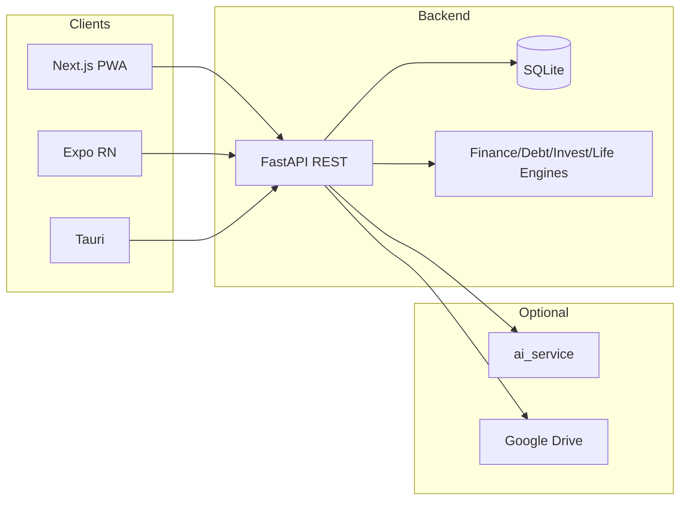
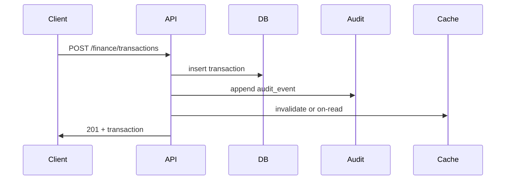
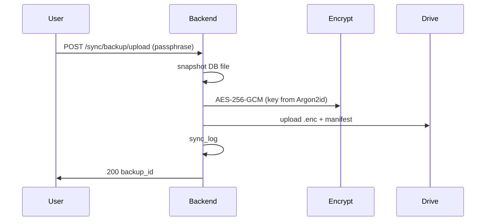
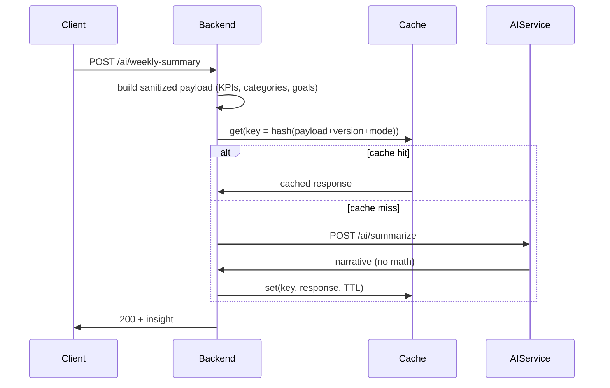

# Pokimate — Architecture

## High-level overview

Pokimate is a local-first personal finance and life app. A single FastAPI backend exposes REST APIs; web (Next.js), mobile (Expo), and desktop (Tauri) clients consume them. Data lives in SQLite. Optional manual encrypted backup to Google Drive; optional AI insights via a small ai_service.

- **No SaaS infra**: No Kubernetes, message brokers, or managed DBs. Everything runs locally with optional Drive sync.

## Component diagram

## Local topology

- Backend: `http://localhost:8000`
- Web dev: `http://localhost:3000`
- Desktop: embeds built web UI; can auto-start backend on port 8000
- Mobile (dev): connects to backend via LAN IP (e.g. `http://192.168.1.x:8000`); offline cache for reads

## Data flow: transaction create

1. Client sends create request.
2. API validates, applies RBAC (user_id), inserts into `transactions`.
3. API appends to `audit_events` (event_type, entity, old/new JSON, actor, device_id, timestamp).
4. Caches (e.g. summary/budget) are invalidated or recomputed on next read.
5. Response returned; UI updates.

## Sync flow

**Restore**: User selects backup → Backend downloads from Drive → verify SHA-256 → decrypt with passphrase → atomic replace local DB → sync_log → reload.

## AI flow

- AI never does math; all calculations are deterministic in backend engines.
- Cache key: `hash(payload + prompt_version + ai_mode)`; TTL e.g. 7 days for weekly, 1 day for daily.

## Database strategy

- **Option A**: Single SQLite DB with `user_id` on every table. Strict RBAC in code; all queries filtered by current user (or admin override).
- Sync: one file to encrypt and upload; restore replaces that file.

## Rationale: no SaaS

- Target is 1–3 users, personal use.
- Local-first and offline-first require local DB and optional sync, not a central cloud DB.
- Avoiding managed infra keeps setup simple and cost-free.
